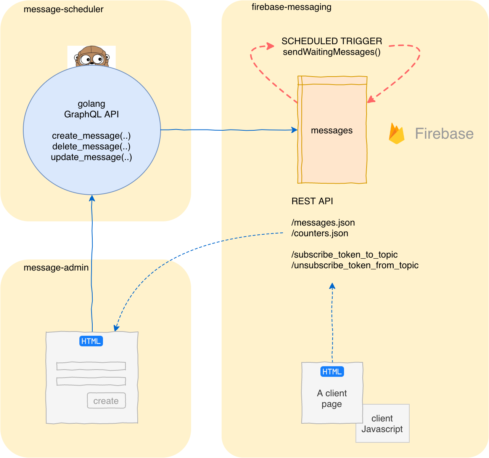

firebase-messaging
==================

Посылка сообщений подписчикам топиков
используя Firebase Cloud Messaging


Предпосылки
-----

В предыдущей реализации уведомления рассылались отдельно каждому 
подписчику, что требовало более 1.5 млн запросов на каждое сообщение. 

В этой реализации используются механизм подписки на топики.
Каждый пользователь подписывается на интересующий его топик.
Все подписчики топика получат сообщение порождаемое одним вызовом
Firebase Cloud Messaging API. Таким образом, необходимое для рассылки количество запросов уменьшается в миллион раз.


Схема приложения
----------
Приложение состоит из 4-х частей: 
1. Go приложение реализующее GraphQL API, для создания, редактирования и удаления сообщений. Git: [message-scheduler]().

2. Firebase приложение для рассылки и хранения посланных 
и запланированных сообщений. Git: [firebase-messaging]().

3. Клиентская javascript библиотека для подключения к HTML страницам и
 отвечающая за подписку/отписку пользователя на выбранный топик. Git:
 [firebase-messaging]().

4. Статическое HTML приложение для тестирования firebase-messaging. 
 Git проект [message-admin]().




Принцип работы
--------

**Отпрака сообщений с задержкой**

Сообщения отправляются с задержкой, чтобы иметь время для коррекции или отмены сообщения.

Редактор, пользуясь приложением `message-admin`, вызывает функцию create_message() приложения `message-scheduler` указав запланированное время отправки сообщения.

Функция message-sheduler.create-message() порождает запись в таблице сообщений `messages` базы данных Firebase, с указанием запланированного времени отправки.


Триггер Firebase sendWaitingMessages() срабатывает через предопределенные интервалы времени. При каждом срабатывании он проверяет
 таблицу `messages` на наличие сообщений подлежащих отправке, и если время подошло отправляет "созревшие" сообщения пользователям.


Тестовое приложение Firebase 
-------

Предназначено для проверки функциональности, и как резервный вариант 
для рассылки сообщений на случай недоступности golang приложения.

- Подписка на сообщения <https://rg-push.firebaseapp.com/>.

- Отправка сообщений <https://rg-push.firebaseapp.com/send.html>.
Лучше открыть в другом браузере для чистоты эксперимента.


message-sheduler GraphQL API
------

- `create_message( text, link, scheduled_time )` 
- `update_message( id, text, link, scheduled_time )`
- `delete_message( id, text, link, scheduled_time )`


Firebase REST API
-------

- `messages.json` - возвращает список сообщений
- `counters.json` - возвращает значения счетчиков
- `subscribe_token_to_topic` - возвращает ok или ошибку
- `unsubscribe_token_from_topic` - возвращает ok или ошибку

Клиентская Javascrit библиотека
-------

Javascrit файл `public/js/topic-subscription.js`, должен быть подключен к HTML странице, для 
подписки/отписки страницы на топики и если необходимо 
для обработки поступающих уведомлений. 


Минимальный пример использования
```html

    <script src="https://www.gstatic.com/firebasejs/7.12.0/firebase-app.js"></script>
    <script src="https://www.gstatic.com/firebasejs/7.12.0/firebase-messaging.js"></script>
    <script src="js/topic-subscription.js"></script>
    <script>
        _TopicSubscription('rgru')
    </script>

```

Пример с обработчиком события входящих сообщений. Срабатывает
только если страница является верхней в браузере.

```html

    <script src="https://www.gstatic.com/firebasejs/7.12.0/firebase-app.js"></script>
    <script src="https://www.gstatic.com/firebasejs/7.12.0/firebase-messaging.js"></script>
    <script src="js/topic-subscription.js"></script>
    <script>
        _TopicSubscription('rgru', payload => {
            console.log("messaging.onMessage. ", payload)
            const dataElement = document.createElement("pre")
            dataElement.textContent = JSON.stringify(payload, null, 2)
            document.querySelector("#messages").appendChild(dataElement)
        })
    </script>

```
или 

```javascript
        ...
        var SUBSCRIPTION_TO_RGRU = _TopicSubscription('rgru')

        SUBSCRIPTION_TO_RGRU.setOnMessageCallback(payload => {
            console.log("messaging.onMessage. ", payload)
            const dataElement = document.createElement("pre")
            dataElement.textContent = JSON.stringify(payload, null, 2)
            document.querySelector("#messages").appendChild(dataElement)
        })
        ...

```


В файле `topic-subscription.js` определена единственная функция
`_TopicSubscription( topicName, onMessageCallback)`, которая может быть вызвана в любой момент, предположительно после загрузки страницы.
Функция возвращает объект со следующими функциями:

```javascript

    return {
        getTopic: () => TOPIC,
        setTopic: (topic) => TOPIC=topic, 
        requestPermission,
        getCurrentToken: () => IID_TOKEN,
        deleteToken,
        subscribeTokenToTopic,
        unsubscribeTokenFromTopic,
        checkAndSubscribeTokenToRGRU,
        getTokenAndSubscribeItToTopic,
        setOnMessageCallback,
    }
```

Worker
-----
Файл `public/firebase-messaging-sw.js` определяет web-worker для приема сообщений и должен находиться в корневой директории ( в той же,что и HTML страница 
подписки ?). `firebase-messaging-sw.js` не обязан упоминаться нигде на клиентской HTML 
странице. 